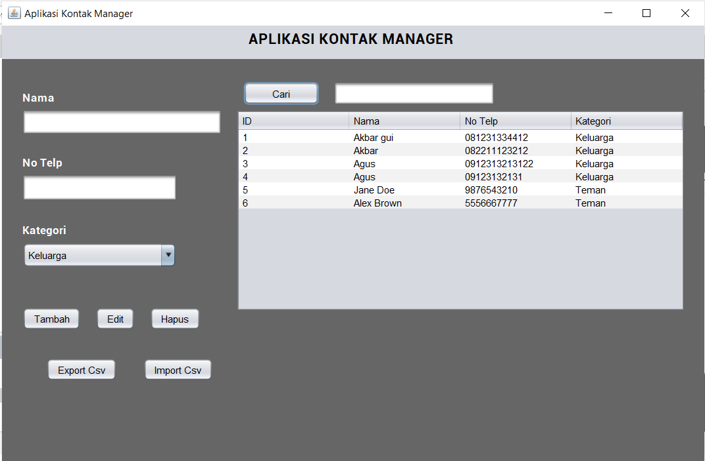
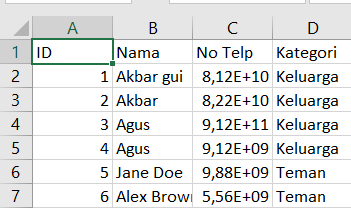
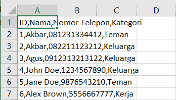

# Aplikasi Pengelolaan Kontak 📱

## Deskripsi Program 📝
Aplikasi Pengelolaan Kontak ini memungkinkan pengguna untuk menyimpan, mengelola, dan mengorganisir informasi kontak. Pengguna dapat menambahkan, mengedit, dan menghapus kontak yang tersimpan di database SQLite. Kontak dapat dikelompokkan berdasarkan kategori seperti Keluarga, Teman, atau Kerja yang dipilih melalui JComboBox.

## Fitur Utama 🔧:
- **Menyimpan informasi kontak** seperti nama, nomor telepon, dan kategori ke dalam database SQLite.
- Pengguna dapat melakukan **CRUD** (Create, Read, Update, Delete) terhadap data kontak yang disimpan.
- **Pencarian kontak** berdasarkan nama atau nomor telepon dan menampilkan hasilnya di JTable.
- **Validasi input** untuk memastikan nomor telepon hanya berisi angka dan memiliki panjang yang sesuai.
- Fitur untuk **mengekspor daftar kontak ke file CSV** dan **mengimpor kontak dari file CSV ke database**.

---

## Komponen GUI 🖥️
Aplikasi ini menggunakan komponen GUI berikut:

- **JFrame**: Sebagai jendela utama aplikasi.
- **JPanel**: Untuk mengelompokkan dan mengatur komponen GUI.
- **JLabel**: Untuk menampilkan label teks.
- **JTextField**: Untuk input teks, seperti nama dan nomor telepon.
- **JButton**: Untuk tombol aksi seperti Tambah, Edit, Hapus, dan Cari.
- **JComboBox**: Untuk memilih kategori kontak (Keluarga, Teman, Kerja).
- **JTable**: Untuk menampilkan daftar kontak yang tersimpan.
- **JScrollPane**: Untuk menyediakan kemampuan scroll pada JTable.

---

## Screenshot 📸
Berikut adalah tampilan aplikasi Aplikasi Pengelolaan Kontak:

- **Tampilan Utama**  
  

- **Ekspor Kontak ke CSV**  
  

- **Impor Kontak dari CSV**  
  

*(Ganti `path/to/your/...` dengan lokasi gambar yang relevan.)*

---

## Logika Program 🔄
1. **Database SQLite**: Digunakan untuk menyimpan data kontak secara lokal.
2. **CRUD (Create, Read, Update, Delete)**: Fitur utama untuk mengelola data kontak yang tersimpan.
3. **Validasi Input**: Memastikan nomor telepon yang dimasukkan hanya berisi angka dan panjangnya sesuai.
4. **Ekspor dan Impor CSV**: Fitur untuk mengekspor dan mengimpor data kontak dari dan ke file CSV.

---

## Event Handling ⚙️
- **ActionListener**: Digunakan untuk menangani aksi pada tombol Tambah, Edit, Hapus, dan Cari.
- **MouseListener**: Digunakan untuk menangani klik pada baris JTable sehingga data tampil di JTextField untuk diedit.
- **ItemListener**: Digunakan untuk menangani perubahan kategori kontak yang dipilih melalui JComboBox.

---

## Variasi dan Fitur Tambahan 🎉
- **Pencarian Kontak**: Pengguna dapat mencari kontak berdasarkan nama atau nomor telepon. Hasil pencarian ditampilkan di JTable.
- **Validasi Input Nomor Telepon**: Pastikan nomor telepon yang dimasukkan hanya berisi angka dan memiliki panjang yang sesuai dengan standar.
- **Ekspor ke CSV**: Daftar kontak dapat diekspor ke file CSV untuk digunakan di aplikasi lain seperti Microsoft Excel.
- **Impor dari CSV**: Kontak yang ada dalam file CSV dapat diimpor dan ditambahkan ke dalam database aplikasi.

---

## Cara Menggunakan 📖
1. **Menambah Kontak** ➕:
   - Masukkan nama, nomor telepon, dan pilih kategori menggunakan JComboBox.
   - Klik tombol Tambah untuk menyimpan kontak ke database.
   
2. **Mengedit Kontak** ✏️:
   - Klik baris pada JTable untuk menampilkan data kontak di JTextField.
   - Edit informasi kontak dan klik tombol Edit untuk memperbarui data.

3. **Menghapus Kontak** ❌:
   - Pilih kontak yang ingin dihapus dari daftar.
   - Klik tombol Hapus untuk menghapus kontak dari database.

4. **Mencari Kontak** 🔍:
   - Masukkan kata kunci pada kolom pencarian (nama atau nomor telepon).
   - Klik tombol Cari untuk menampilkan hasil pencarian di JTable.

5. **Ekspor Kontak ke CSV** 📤:
   - Klik tombol Ekspor untuk menyimpan daftar kontak ke file CSV.

6. **Impor Kontak dari CSV** 📥:
   - Klik tombol Impor untuk mengimpor daftar kontak dari file CSV ke aplikasi.

---

## Penulis ✍️
- **Nama**: M. Rafly Aulia Akbar  
- **NPM**: 2210010574   
- **Kelas**: 5B TI Reg BJB

---

## Teknologi yang Digunakan 💻
- **Java**: Bahasa pemrograman utama untuk aplikasi.
- **SQLite**: Database lokal untuk menyimpan data kontak.
- **NetBeans**: Untuk pembuatan antarmuka grafis (GUI).
- **CSV**: Untuk fitur ekspor dan impor data kontak.
