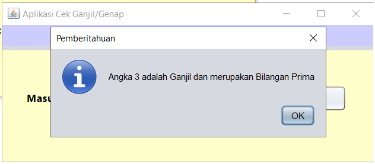

# Aplikasi Cek Ganjil/Genap

Aplikasi **Cek Ganjil/Genap** adalah sebuah program berbasis GUI (Graphical User Interface) yang dibuat menggunakan **Java Swing** di NetBeans IDE. Aplikasi ini dirancang untuk memeriksa apakah sebuah angka yang dimasukkan adalah bilangan ganjil atau genap, serta memberikan informasi apakah bilangan tersebut adalah bilangan prima.

---

## Fitur Utama

1. **Cek Ganjil/Genap**: Menentukan apakah angka yang dimasukkan adalah bilangan ganjil atau genap.
2. **Validasi Input**:
   - Hanya menerima angka sebagai input.
   - Memberikan pesan peringatan jika input tidak valid.
3. **Cek Bilangan Prima**: Menentukan apakah angka yang dimasukkan adalah bilangan prima.
4. **GUI Interaktif**:
   - Dibangun dengan JFrame.
   - Input angka melalui JTextField dengan validasi otomatis.
   - Output hasil ditampilkan menggunakan dialog JOptionPane.

---

## Cara Menggunakan

1. Jalankan aplikasi dari NetBeans IDE atau file JAR yang telah dihasilkan.
2. Masukkan angka ke dalam kotak input.
3. Klik tombol **Cek**.
4. Informasi mengenai angka (ganjil/genap dan apakah bilangan prima) akan ditampilkan di dialog notifikasi.

---

## Teknologi yang Digunakan

- **Java**: Bahasa pemrograman utama.
- **Java Swing**: Untuk antarmuka pengguna grafis (GUI).
- **NetBeans IDE**: Untuk pengembangan dan debugging.

---

## Struktur Kode Utama

### 1. **Validasi Input**

- Input hanya menerima angka melalui validasi pada `KeyListener`.
- Menampilkan pesan peringatan jika input tidak valid.

### 2. **Cek Ganjil/Genap**

```java
if (angka % 2 == 0) {
    hasil.append("Angka ").append(angka).append(" adalah Genap");
} else {
    hasil.append("Angka ").append(angka).append(" adalah Ganjil");
}
```

### 3. **Cek Bilangan Prima**

```java
private boolean isPrima(int angka) {
    if (angka <= 1) {
        return false;
    }
    for (int i = 2; i <= Math.sqrt(angka); i++) {
        if (angka % i == 0) {
            return false;
        }
    }
    return true;
}
```

### 4. **FocusListener untuk Input Text Field**

- Membersihkan teks placeholder saat pengguna mulai mengetik:

```java
inputTextField.addFocusListener(new FocusListener() {
    @Override
    public void focusGained(FocusEvent e) {
        inputTextField.setText("");
    }

    @Override
    public void focusLost(FocusEvent e) {
        if (inputTextField.getText().trim().isEmpty()) {
            inputTextField.setText("Masukkan angka");
        }
    }
});
```

---

## Screenshot



---

## Dibuat Oleh

M.Rafly Aulia Akbar(2210010574)
