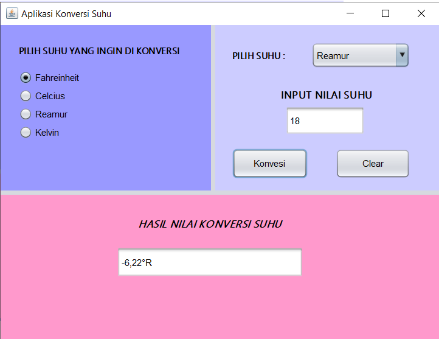

# Aplikasi Konversi Suhu

Aplikasi **Konversi Suhu** adalah sebuah program berbasis GUI (Graphical User Interface) yang dibuat menggunakan **Java Swing**. Aplikasi ini dirancang untuk membantu pengguna mengonversi nilai suhu dari satu skala ke skala lainnya dengan mudah.

---

## 📝 Deskripsi Program

Aplikasi ini menawarkan tampilan GUI yang terdiri dari beberapa komponen:

- **JTextField** untuk input nilai suhu dari pengguna.
- **JButton** untuk tombol "Konversi" dan "Clear".
- **JRadioButton** untuk memilih skala suhu awal.
- **JComboBox** untuk memilih skala suhu akhir.
- **JLabel** untuk menampilkan hasil konversi suhu.

### Fitur Utama:

- **Validasi Input**: Program memeriksa apakah input dari pengguna adalah angka valid.
- **Konversi Otomatis**: Nilai suhu otomatis dikonversi saat pengguna mengetikkan input (jika fitur ini diaktifkan).
- **Berbagai Skala Suhu**: Mendukung konversi antara Celcius, Fahrenheit, Reamur, dan Kelvin.
- **Pesan Error**: Jika input tidak valid, akan ditampilkan pesan error melalui JOptionPane.

---

## 🖥️ Komponen GUI yang Digunakan

Aplikasi ini menggunakan komponen-komponen dari Java Swing, yaitu:

- **JFrame**: Sebagai frame utama aplikasi.
- **JPanel**: Container untuk elemen-elemen UI lainnya.
- **JLabel**: Menampilkan teks informasi dan hasil konversi suhu.
- **JTextField**: Tempat input nilai suhu oleh pengguna.
- **JButton**: Tombol "Konversi" untuk memulai proses konversi dan "Clear" untuk menghapus input.
- **JRadioButton**: Pilihan skala suhu awal.
- **JComboBox**: Pilihan skala suhu akhir.

---

## ⚙️ Logika Program

Logika yang digunakan dalam aplikasi mencakup:

- **Kondisional (if-else)**: Untuk menentukan skala awal dan akhir yang dipilih oleh pengguna.
- **Validasi Input**: Membatasi input pada angka valid dengan KeyAdapter.
- **Konversi Suhu**: Implementasi formula untuk konversi suhu antara Celcius, Fahrenheit, Reamur, dan Kelvin.

### Formula Konversi Suhu

1. **Celcius ke Fahrenheit**:
   ```
   F = (C × 9/5) + 32
   ```
2. **Celcius ke Reamur**:
   ```
   R = C × 4/5
   ```
3. **Celcius ke Kelvin**:
   ```
   K = C + 273.15
   ```
4. Formula untuk konversi dari skala lain juga diterapkan sesuai standar.

---

## 📚 Cara Menggunakan Aplikasi

1. Jalankan aplikasi.
2. Pilih skala suhu awal menggunakan JRadioButton.
3. Masukkan nilai suhu pada JTextField.
4. Pilih skala suhu akhir menggunakan JComboBox.
5. Klik tombol "Konversi" untuk melihat hasil konversi.
6. Gunakan tombol "Clear" untuk menghapus input dan mengatur ulang.

---

## 💻 Instalasi dan Jalankan Program

Pastikan Anda telah menginstal Java di sistem Anda, kemudian ikuti langkah-langkah berikut:

1. **Download atau clone repository** ini ke mesin lokal Anda:

   ```bash
   git clone <repository-url>
   ```

2. **Kompilasi program** dengan perintah berikut di terminal:

   ```bash
   javac AplikasiKonversiSuhu.java
   ```

3. **Jalankan program** menggunakan perintah:

   ```bash
   java AplikasiKonversiSuhu
   ```

---

## 📸 Screenshot

Berikut adalah screenshot dari aplikasi:



---

## 📜 Lisensi

Aplikasi ini dibuat untuk tujuan pembelajaran dan bersifat open-source. Anda bebas untuk memodifikasi dan mendistribusikan ulang aplikasi ini sesuai dengan kebutuhan Anda.

---

## ✍️ Penulis

- **Nama**: M. Rafly Aulia Akbar
- **NPM**: 2210010574
- **Kelas**: 5B REG BJB TI

Terima kasih telah menggunakan aplikasi ini.

