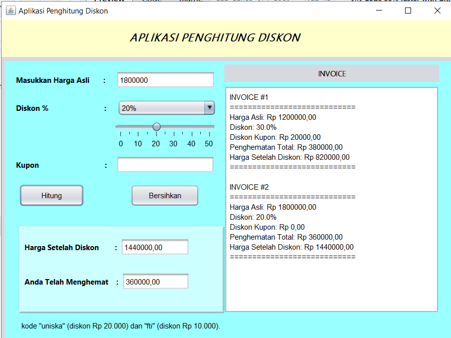

# Aplikasi Penghitung Diskon

Aplikasi **Penghitung Diskon** adalah sebuah program berbasis GUI (Graphical User Interface) yang dibuat menggunakan **Java Swing**. Aplikasi ini dirancang untuk membantu pengguna menghitung harga setelah diskon, dengan berbagai fitur tambahan seperti penggunaan kupon.

---

## 📝 Deskripsi Program

Aplikasi ini menawarkan tampilan GUI yang terdiri dari beberapa komponen:

- **JTextField** untuk input harga asli dan kode kupon dari pengguna.
- **JSlider** untuk memilih persentase diskon.
- **JComboBox** untuk memilih diskon dengan nilai tetap.
- **JButton** untuk tombol "Hitung" dan "Bersihkan".
- **JLabel** untuk menampilkan hasil harga setelah diskon dan penghematan total.
- **JTextArea** untuk menampilkan invoice secara terperinci.

### Fitur Utama:

- **Perhitungan Diskon**: Menghitung harga setelah diskon dengan berbagai opsi persentase.
- **Kode Kupon**: Dukungan untuk kode kupon khusus seperti "uniska" (diskon Rp20.000) dan "fti" (diskon Rp10.000).
- **Validasi Input**: Memastikan input dari pengguna berupa angka yang valid.
- **Invoice**: Menampilkan rincian transaksi dalam format invoice di JTextArea.

---

## 🖥️ Komponen GUI yang Digunakan

Aplikasi ini menggunakan komponen-komponen dari Java Swing, yaitu:

- **JFrame**: Sebagai frame utama aplikasi.
- **JPanel**: Container untuk elemen-elemen UI lainnya.
- **JLabel**: Menampilkan teks informasi dan hasil perhitungan.
- **JTextField**: Tempat input harga asli dan kode kupon.
- **JButton**: Tombol "Hitung" untuk memulai perhitungan dan "Bersihkan" untuk mengatur ulang input.
- **JSlider**: Pilihan persentase diskon (0% hingga 50%).
- **JComboBox**: Pilihan persentase diskon tetap.
- **JTextArea**: Menampilkan invoice transaksi.

---

## ⚙️ Logika Program

Logika yang digunakan dalam aplikasi mencakup:

- **Kondisional (if-else)**: Untuk memproses diskon dan kode kupon yang dimasukkan oleh pengguna.
- **Perhitungan Diskon**: Menghitung total diskon dari kombinasi persentase dan kupon.
- **Validasi Input**: Membatasi input pada angka valid dengan pengecekan string.

### Formula Perhitungan Diskon

1. **Diskon Persentase**:
   ```
   Jumlah Diskon = (Persentase Diskon / 100) × Harga Asli
   ```
2. **Diskon Total**:
   ```
   Diskon Total = Jumlah Diskon + Diskon Kupon
   ```
3. **Harga Setelah Diskon**:
   ```
   Harga Setelah Diskon = Harga Asli - Diskon Total
   ```

---

## 📚 Cara Menggunakan Aplikasi

1. Jalankan aplikasi.
2. Masukkan harga asli pada JTextField.
3. Pilih persentase diskon menggunakan JSlider atau JComboBox.
4. (Opsional) Masukkan kode kupon jika tersedia.
5. Klik tombol "Hitung" untuk melihat hasil perhitungan.
6. Hasil harga setelah diskon dan penghematan akan ditampilkan di JLabel dan JTextArea.
7. Gunakan tombol "Bersihkan" untuk menghapus semua input dan mengatur ulang aplikasi.

---

## 💻 Instalasi dan Jalankan Program

Pastikan Anda telah menginstal Java di sistem Anda, kemudian ikuti langkah-langkah berikut:

1. **Download atau clone repository** ini ke mesin lokal Anda:

   ```bash
   git clone <repository-url>
   ```

2. **Kompilasi program** dengan perintah berikut di terminal:

   ```bash
   javac ApilikasiPenghitungDiskon.java
   ```

3. **Jalankan program** menggunakan perintah:

   ```bash
   java ApilikasiPenghitungDiskon
   ```

---

## 📸 Screenshot

Berikut adalah screenshot dari aplikasi:



---

## 📜 Lisensi

Aplikasi ini dibuat untuk tujuan pembelajaran dan bersifat open-source. Anda bebas untuk memodifikasi dan mendistribusikan ulang aplikasi ini sesuai dengan kebutuhan Anda.

---

## ✍️ Penulis

- **Nama**: M. Rafly Aulia Akbar
- **NPM**: 2210010574
- **Kelas**: 5B REG BJB TI

Terima kasih telah menggunakan aplikasi ini.

