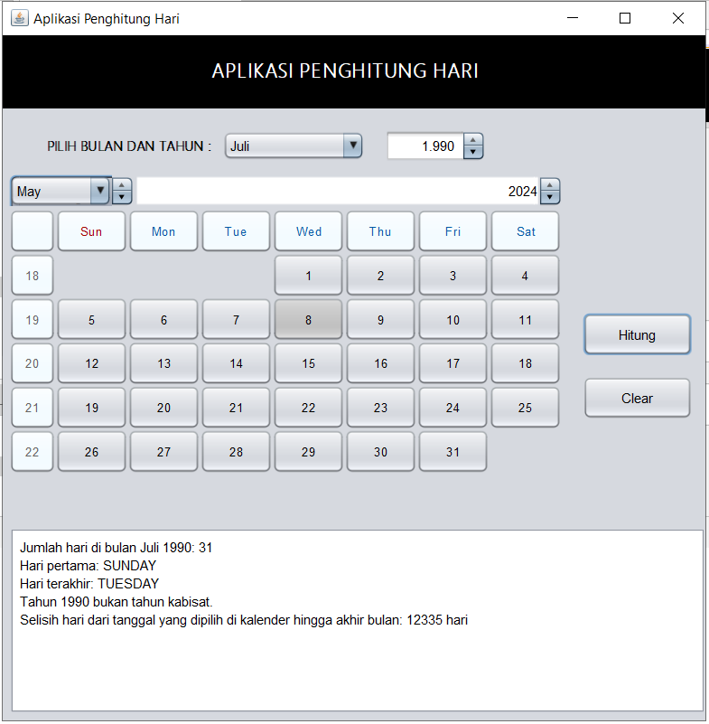

# Aplikasi Penghitung Hari

Aplikasi **Penghitung Hari** adalah program berbasis GUI (Graphical User Interface) yang dibuat menggunakan **Java Swing**. Aplikasi ini memungkinkan pengguna untuk menghitung jumlah hari dalam suatu bulan tertentu, menentukan hari pertama dan terakhir bulan tersebut, serta menghitung selisih hari dari tanggal yang dipilih hingga akhir bulan.

---

## 📝 Deskripsi Program

Aplikasi ini menyediakan antarmuka pengguna grafis dengan beberapa komponen utama:

- **JSpinner**: Memilih tahun.
- **JComboBox**: Memilih bulan.
- **JCalendar**: Memilih hari pada kalender.
- **JButton**: Tombol "Hitung" untuk memproses perhitungan dan tombol "Clear" untuk mengatur ulang input.
- **JTextArea**: Menampilkan hasil perhitungan secara detail.

### Fitur Utama:

- **Jumlah Hari**: Menghitung jumlah hari dalam bulan tertentu.
- **Tahun Kabisat**: Menentukan apakah tahun tersebut adalah tahun kabisat.
- **Hari Pertama dan Terakhir**: Menampilkan nama hari pertama dan terakhir dalam bulan tersebut.
- **Selisih Hari**: Menghitung selisih hari dari tanggal yang dipilih hingga akhir bulan.
- **Penghitungan Otomatis**: Hasil akan dihitung secara otomatis setiap kali pengguna mengubah tanggal, bulan, atau tahun.

---

## 🖥️ Komponen GUI yang Digunakan

Aplikasi ini menggunakan komponen-komponen dari Java Swing, yaitu:

- **JFrame**: Sebagai frame utama aplikasi.
- **JPanel**: Container untuk elemen-elemen UI lainnya.
- **JLabel**: Menampilkan teks informasi.
- **JComboBox**: Memilih bulan.
- **JSpinner**: Memilih tahun.
- **JCalendar**: Kalender interaktif untuk memilih tanggal.
- **JTextArea**: Menampilkan hasil perhitungan.
- **JButton**: Tombol untuk aksi "Hitung" dan "Clear".

---

## ⚙️ Logika Program

Logika yang digunakan dalam aplikasi mencakup:

- **Perhitungan Hari**: Menggunakan kelas `YearMonth` untuk menghitung jumlah hari dalam bulan tertentu.
- **Validasi Tahun Kabisat**: Menggunakan logika matematika untuk menentukan apakah tahun tersebut kabisat.
- **Selisih Hari**: Menggunakan `ChronoUnit.DAYS` untuk menghitung jumlah hari antara dua tanggal.
- **Penghitungan Otomatis**: Listener pada komponen akan memproses penghitungan secara otomatis setiap kali ada perubahan input.

### Formula dan Logika Utama

1. **Jumlah Hari**:
   ```
   Jumlah Hari = YearMonth.of(tahun, bulan).lengthOfMonth()
   ```
2. **Selisih Hari**:
   ```
   Selisih Hari = ChronoUnit.DAYS.between(tanggalDipilih, akhirBulan)
   ```
3. **Validasi Tahun Kabisat**:
   ```
   Tahun Kabisat = (tahun % 4 == 0) && (tahun % 100 != 0 || tahun % 400 == 0)
   ```

---

## 📚 Cara Menggunakan Aplikasi

1. Jalankan aplikasi.
2. Pilih bulan dan tahun menggunakan **JComboBox** dan **JSpinner**.
3. Pilih tanggal menggunakan **JCalendar**.
4. Hasil perhitungan (jumlah hari, tahun kabisat, selisih hari) akan muncul secara otomatis di **JTextArea**.
5. Gunakan tombol "Clear" untuk mengatur ulang semua input dan hasil.

---

## 💻 Instalasi dan Jalankan Program

Pastikan Anda telah menginstal Java di sistem Anda, kemudian ikuti langkah-langkah berikut:

1. **Download atau clone repository** ini ke mesin lokal Anda:

   ```bash
   git clone <repository-url>
   ```

2. **Kompilasi program** dengan perintah berikut di terminal:

   ```bash
   javac AplikasiPenghitungHari.java
   ```

3. **Jalankan program** menggunakan perintah:

   ```bash
   java AplikasiPenghitungHari
   ```

---

## 📸 Screenshot

Berikut adalah screenshot dari aplikasi:



---

## 📜 Lisensi

Aplikasi ini dibuat untuk tujuan pembelajaran dan bersifat open-source. Anda bebas untuk memodifikasi dan mendistribusikan ulang aplikasi ini sesuai dengan kebutuhan Anda.

---

## ✍️ Penulis

- **Nama**: M. Rafly Aulia Akbar
- **NPM**: 2210010574
- **Kelas**: 5B REG BJB TI

Terima kasih telah menggunakan aplikasi ini.
