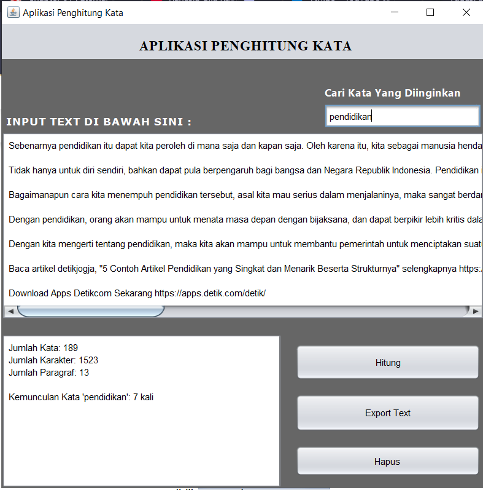

# Aplikasi Penghitung Kata

Aplikasi **Penghitung Kata** adalah program berbasis GUI (Graphical User Interface) yang dibuat menggunakan **Java Swing**. Aplikasi ini memungkinkan pengguna untuk menghitung jumlah kata, karakter, paragraf, serta mencari jumlah kemunculan kata tertentu dalam sebuah teks.

---

## 📝 Deskripsi Program

Aplikasi ini menyediakan antarmuka pengguna grafis dengan beberapa komponen utama:

- **JTextArea**: Tempat pengguna untuk memasukkan teks.
- **JTextField**: Untuk mencari jumlah kemunculan kata tertentu.
- **JButton**: Tombol "Hitung", "Export Text", dan "Hapus" untuk berbagai aksi.
- **JTextArea (Output)**: Menampilkan hasil perhitungan secara detail.

### Fitur Utama:

- **Hitung Jumlah Kata**: Menghitung total kata dalam teks yang dimasukkan.
- **Hitung Jumlah Karakter**: Menghitung total karakter, termasuk spasi.
- **Hitung Jumlah Paragraf**: Menghitung jumlah paragraf berdasarkan pemisah baris kosong.
- **Pencarian Kata**: Mencari dan menghitung kemunculan kata tertentu dalam teks.
- **Export Hasil**: Menyimpan teks beserta hasil perhitungan ke file `.txt`.
- **Hapus Input**: Menghapus semua teks input dan output secara mudah.
- **Real-Time Update**: Hasil dihitung secara otomatis saat teks atau kata pencarian diperbarui.

---

## 🖥️ Komponen GUI yang Digunakan

Aplikasi ini menggunakan komponen-komponen dari Java Swing, yaitu:

- **JFrame**: Sebagai frame utama aplikasi.
- **JPanel**: Container untuk elemen-elemen UI lainnya.
- **JLabel**: Menampilkan teks informasi.
- **JTextArea**: Tempat input teks dan hasil perhitungan.
- **JTextField**: Untuk pencarian kata tertentu.
- **JButton**: Tombol untuk aksi "Hitung", "Export", dan "Hapus".

---

## ⚙️ Logika Program

Logika yang digunakan dalam aplikasi mencakup:

- **Penghitungan Kata**: Memisahkan teks berdasarkan spasi atau karakter khusus menggunakan ekspresi reguler (`\s+`).
- **Penghitungan Paragraf**: Menghitung jumlah baris teks yang tidak kosong.
- **Pencarian Kata**: Menghitung jumlah kemunculan kata tertentu dengan membandingkan string secara case-insensitive.
- **Export Hasil**: Menyimpan teks input dan hasil perhitungan ke file `.txt` menggunakan `BufferedWriter`.

### Formula dan Logika Utama

1. **Jumlah Kata**:
   ```
   Jumlah Kata = teks.split("\\s+").length
   ```
2. **Jumlah Karakter**:
   ```
   Jumlah Karakter = teks.length()
   ```
3. **Jumlah Paragraf**:
   ```
   Jumlah Paragraf = teks.split("\\n").length
   ```
4. **Kemunculan Kata**:
   ```
   Kemunculan Kata = countOccurrences(teks, kata)
   ```

---

## 📚 Cara Menggunakan Aplikasi

1. Jalankan aplikasi.
2. Masukkan teks pada **JTextArea** input.
3. (Opsional) Masukkan kata tertentu pada **JTextField** untuk mencari kemunculannya.
4. Klik tombol "Hitung" untuk melihat hasil perhitungan.
5. Gunakan tombol "Export Text" untuk menyimpan teks dan hasil ke file.
6. Klik tombol "Hapus" untuk mengatur ulang input dan hasil.

---

## 💻 Instalasi dan Jalankan Program

Pastikan Anda telah menginstal Java di sistem Anda, kemudian ikuti langkah-langkah berikut:

1. **Download atau clone repository** ini ke mesin lokal Anda:

   ```bash
   git clone <repository-url>
   ```

2. **Kompilasi program** dengan perintah berikut di terminal:

   ```bash
   javac AplikasiPenghitungKata.java
   ```

3. **Jalankan program** menggunakan perintah:

   ```bash
   java AplikasiPenghitungKata
   ```

---

## 📸 Screenshot

Berikut adalah screenshot dari aplikasi:



---

## 📜 Lisensi

Aplikasi ini dibuat untuk tujuan pembelajaran dan bersifat open-source. Anda bebas untuk memodifikasi dan mendistribusikan ulang aplikasi ini sesuai dengan kebutuhan Anda.

---

## ✍️ Penulis

- **Nama**: M. Rafly Aulia Akbar
- **NPM**: 2210010574
- **Kelas**: 5B REG BJB TI

Terima kasih telah menggunakan aplikasi ini! Jika Anda menemukan bug atau memiliki saran, silakan buka Issue di repository ini.

