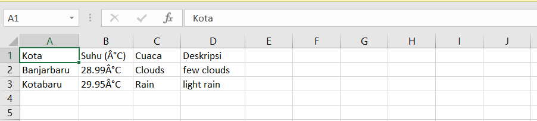

# 🌦️ Aplikasi Cek Cuaca
Aplikasi Cek Cuaca adalah aplikasi Java berbasis GUI yang memungkinkan pengguna untuk memeriksa cuaca pada kota tertentu menggunakan data dari API OpenWeatherMap. Aplikasi ini memungkinkan pengguna untuk memilih kota favorit, menambahkan kota baru ke favorit, serta menyimpan hasil data cuaca dalam bentuk file CSV untuk referensi di masa mendatang.

## 📜 Deskripsi Program
Aplikasi ini menyediakan beberapa fitur utama:

- **Input Kota**: Pengguna dapat memasukkan nama kota secara manual.
- **Cek Cuaca**: Setelah menekan tombol "Cek", aplikasi akan menampilkan data cuaca pada kota yang dipilih atau yang dimasukkan oleh pengguna.
- **Tambah Kota ke Favorit**: Kota yang dimasukkan dapat ditambahkan ke daftar kota favorit untuk akses yang lebih mudah di masa mendatang.
- **Simpan Data ke CSV**: Data cuaca yang ditampilkan dapat disimpan ke dalam file CSV untuk referensi lebih lanjut.

## ✨ Fitur Utama
1. **Cek Cuaca**: Menampilkan informasi suhu, cuaca, dan deskripsi cuaca berdasarkan data dari API.
2. **Tambah ke Favorit**: Menambahkan kota ke daftar favorit.
3. **Simpan ke CSV**: Menyimpan hasil cuaca yang ditampilkan ke dalam file CSV dengan format yang rapi untuk diakses di Excel.

## 🛠️ Komponen GUI yang Digunakan
- **JFrame**: Frame utama aplikasi.
- **JPanel**: Panel untuk mengatur tata letak komponen.
- **JLabel**: Menampilkan informasi cuaca, suhu, dan deskripsi cuaca.
- **JTextField**: Input untuk memasukkan nama kota.
- **JComboBox**: Memilih kota favorit dari daftar yang telah disimpan.
- **JButton**: Tombol untuk cek cuaca, tambah favorit, dan simpan ke CSV.

## 📷 Screenshot Aplikasi

### 1. Tampilan Utama
Pada tampilan utama, pengguna dapat memasukkan nama kota pada kolom "Cek Cuaca di Kota" atau memilih dari daftar kota favorit.


### 2. Hasil Setelah Menekan Tombol Cek
Setelah menekan tombol **Cek**, aplikasi akan menampilkan data cuaca lengkap di area bawah dan pada tabel yang berisi informasi suhu dan deskripsi cuaca.


### 3. Menambahkan Kota ke Favorit
Ketika pengguna menekan tombol **Tambah Ke Favorit**, kota yang dimasukkan akan ditambahkan ke daftar Kota Favorit, dan notifikasi akan muncul untuk mengonfirmasi penambahan.


### 4. Menyimpan Data Cuaca ke CSV
Dengan menekan tombol **Save to CSV**, aplikasi akan menyimpan data cuaca dalam file CSV yang dapat dibuka di aplikasi spreadsheet seperti Excel.


### 5. Hasil CSV yang Rapi di Excel
Data CSV yang diekspor akan tertata rapi di Excel dengan kolom:

```
Kota            Suhu (°C)    Cuaca       Deskripsi
Tabalong        28.5°C      Clear       Clear sky
BanjarBaru      30.0°C      Rain        Light rain
```

## 📚 Cara Menggunakan Aplikasi
1. Jalankan aplikasi.
2. Masukkan nama kota pada kolom **Cek Cuaca di Kota** atau pilih kota dari **Kota Favorit**.
3. Klik **Cek** untuk menampilkan cuaca di kota yang dipilih.
4. Untuk menambahkan kota ke daftar favorit, masukkan nama kota dan klik **Tambah Ke Favorit**.
5. Klik **Save to CSV** untuk menyimpan data cuaca yang ditampilkan ke dalam file CSV.

## 💻 Instalasi dan Menjalankan Program
Pastikan Java sudah terinstal di sistem Anda. Ikuti langkah-langkah berikut:

1. Download atau clone repository ini ke mesin lokal Anda.
2. Kompilasi program dengan perintah berikut:
   ```bash
   javac AplikasiCekCuaca.java
   ```
3. Jalankan aplikasi dengan perintah:
   ```bash
   java AplikasiCekCuaca
   ```

## 🌐 API yang Digunakan
Aplikasi ini menggunakan API dari **OpenWeatherMap** untuk mendapatkan data cuaca. Pastikan Anda memiliki API Key yang valid untuk menjalankan aplikasi. Anda dapat mengganti nilai `API_KEY` di bagian kode berikut:

```java
private static final String API_KEY = "MASUKKAN_API_KEY_ANDA_DI_SINI";
```

## 👤 Penulis
- **Nama**: M. Rafly Aulia Akbar
- **NPM**: 2210010574
- **Kelas**: 5B Reguler Pagi BJB

Selamat menggunakan **Aplikasi Cek Cuaca**! 🌧️🌞